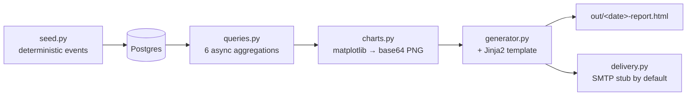

# team-activity-report


[](LICENSE)

Open-source reference implementation of the "scheduled report from a database" pattern, using synthetic engineering-team activity (PRs, builds, deploys, incidents) as the demo domain.

## The Pattern

A daily report aggregates the prior day's events from a Postgres database, renders them into an HTML document with embedded charts, applies weekday/holiday gating, and (optionally) sends via SMTP. The production version of this system runs privately at my employer against a different domain. This repo demonstrates the architecture on synthetic engineering-team data so the patterns are verifiable.

Three properties matter:

1. **Idempotent generation** — running for the same target date produces a byte-identical output file
2. **Weekday-gated by default** — skips Saturdays, Sundays, and US federal holidays unless `--force` is passed
3. **Deterministic seed** — the same RNG seed produces the same synthetic events, so tests can make exact assertions

## Architecture



## Quick Start

```bash
git clone https://github.com/Jamil1016/report-automation
cd report-automation
docker compose up -d
pip install -e .
cp .env.example .env
python -m team_activity_report init-db
python -m team_activity_report seed-data --days 30
python -m team_activity_report run --date 2026-05-26
open out/2026-05-26-report.html
```

## How It Works

- **Deterministic seed:** `team_activity_report/seed.py` generates ~1,000 events across 5 fictional developers and 3 fictional repos over 30 days. Same `--seed` value produces the same events.
- **Typed query layer:** `queries.py` exposes 6 async functions returning `TypedDict` results. Tests assert on exact counts against the seeded data.
- **Idempotent rendering:** `charts.py` overrides matplotlib's PNG timestamp metadata, the Jinja2 footer uses a constant string (no live timestamp), and `generator.py` writes a deterministic filename — so running twice produces a byte-identical file. `test_generator.py::test_idempotent_byte_identical` validates this with a SHA-256 check.
- **Weekday gate:** `gate.py` exposes pure functions for `is_weekend`, `is_holiday`, and `should_run`. The CLI checks `should_run` before generating; `--force` overrides for testing.
- **SMTP stub default:** `delivery.send_smtp` logs "Would send to X" unless `SMTP_HOST`, `SMTP_USER`, and `SMTP_PASS` are all set in the environment. The demo can run `--email` safely.

## Tests

```bash
pytest                              # all tests (requires Docker for testcontainers)
SKIP_INTEGRATION_TESTS=1 pytest     # unit only — fast, no DB
pytest --cov                        # with coverage
```

| Test file | Covers |
|---|---|
| `test_gate.py` | Weekday + holiday gating |
| `test_seed.py` | Determinism, distribution rules |
| `test_queries.py` | Aggregation correctness against seeded data |
| `test_charts.py` | Valid PNG output + determinism |
| `test_generator.py` | Full run + idempotent SHA-256 |
| `test_delivery.py` | SMTP stub when env missing, real send when present |
| `test_cli.py` | argparse + dispatch (mocked DB) |

## Background

I built this pattern at scale at $WORK (private repo, different domain). The case study with production metrics is at:

**https://portfolio-gules-gamma-14.vercel.app/projects/report-automation**

## License

MIT
